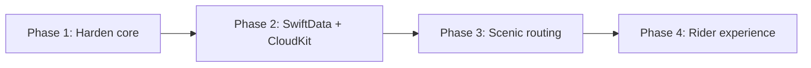

# PerfectRouter - Product Requirements Document (PRD)

Product requirements for **PerfectRouter**, a SwiftUI + MapKit iOS app for planning motorcycle rides. This PRD documents the product as it exists today and frames a forward-looking vision that incorporates the v2 ideas from the project README.

> UX flows, screen design, and the design system live in the companion document: [UXDesign.md](UXDesign.md).

---

## 1. Overview & Vision

**One-liner:** PerfectRouter helps motorcyclists plan multi-stop rides that are aware of the things car-routing apps ignore - fuel range, weather, and the kinds of stops riders actually want along the way.

**Problem statement:** General-purpose navigation apps (Apple Maps, Google Maps) optimize for the fastest car trip from A to B. Motorcyclists think differently. They care about:
- Whether they can make the next stretch on one tank of fuel.
- Where to stop for gas, food, coffee, or a good view.
- Whether they will ride into rain.
- Reordering a day's worth of stops, then sharing the plan with their riding group.

PerfectRouter treats the ride - not just the destination - as the unit of planning.

**What makes it different:**
- **Fuel-range awareness:** the app plans refuel stops around the rider's actual tank range and warns when a stretch has no reachable gas.
- **Corridor-based discovery:** stops are searched along the whole route corridor, not just near the endpoints.
- **Weather on the route:** rain risk is evaluated at the rider's expected time of passing each segment, not just "now at home."
- **Built for sharing:** a planned ride is a portable object that can be saved and shared via a link, so a group can ride the same plan.

---

## 2. Target Users & Personas

### Persona A - The Weekend Tourer ("Sam")
Rides for fun on weekends, 100-300 mile day loops. Wants scenic stops and a good lunch spot, doesn't want to run dry on a backroad. Values a quick, visual plan over precise turn-by-turn.

### Persona B - The Long-Distance / Adventure Rider ("Dana")
Multi-hundred-mile days, sometimes across sparse areas. Fuel range is a real constraint; a missed gas station is a serious problem. Cares deeply about fuel-gap warnings and weather ahead.

### Persona C - The Group Ride Organizer ("Mateo")
Plans rides for 4-10 friends. Needs to assemble a route with agreed stops and distribute it so everyone has the same plan on their phone. Save + share is the core workflow.

---

## 3. Goals & Non-Goals

### Goals
- Let a rider assemble a multi-stop ride quickly on a map.
- Recommend useful stops (gas, food, coffee, scenic) along the route corridor.
- Plan refuel stops automatically based on the rider's tank range and warn about fuel gaps.
- Surface rain risk along the route before departure.
- Persist rides locally and share them with other riders via a link.

### Non-Goals (current)
- Turn-by-turn voice navigation (hand off to a dedicated nav app instead).
- Account system / server backend (rides are device-local + link-shared).
- Curvy/"twisty road" route optimization (Apple routing does not support it yet - see roadmap).
- Real-time group location tracking.

---

## 4. Core User Journeys (summary)

At a product level, the key journeys are:
1. **Plan a ride** - set a start, add a destination, get a multi-leg route with summary.
2. **Refuel-aware planning** - set tank range; the app places refuel stops and flags fuel gaps.
3. **Discover stops** - switch category and add gas/food/coffee/scenic stops along the corridor.
4. **Save & share** - save a ride locally or send a `perfectrouter://` link so a group rides the same plan.

> Detailed step-by-step flows and diagrams are in [UXDesign.md, section 2](UXDesign.md#2-core-user-journeys).

---

## 5. Feature Spec (Current Build)

### 5.1 Multi-stop routing
- One `MKDirections` request per consecutive waypoint pair; each leg's `MKRoute` is stored and drawn as a blue polyline.
- Ride summary aggregates total distance and expected travel time across legs.
- Source: `RoutePlannerViewModel.recalculateRoute()`.

### 5.2 Waypoint management
- First place added is treated as the destination; the start is auto-seeded from current location when available.
- When there's no location fix, the rider drops a start via long-press or "use current map area as start."
- Waypoints can be reordered (drag) and removed (swipe); any change re-routes.

### 5.3 Stop suggestions along the corridor
- `StopSuggestionService` samples the route polyline (default every ~25 mi / `sampleIntervalMeters = 40_000`), runs an `MKLocalSearch` per sample for the selected category, keeps results within ~5 mi (`corridorRadiusMeters = 8_000`), and de-duplicates by name + rounded coordinates.
- Searches are capped (first ~10 samples) to avoid `MKLocalSearch` throttling on long rides.
- Categories and their queries/icons live in `StopCategory` (Gas, Food, Coffee, Scenic).

### 5.4 Automatic fuel planning
- All gas stations along the route are found independent of the selected category.
- Candidates are filtered to the rider's **side of travel** (`RouteGeometry.isOnTravelSide`) so a refuel doesn't require crossing oncoming traffic.
- `planFuelStops` greedily selects ~one stop per tank, preferring the farthest station within a comfort window (`fuelSafetyFactor = 0.85`) and flagging `hasFuelGap` when nothing is reachable.
- Recommended fuel stops are highlighted on the map (ringed green pump) and badged in the list.

### 5.5 Rider-adjustable fuel range
- Slider 50-300 mi (stored internally in meters, default ~100 mi). On release, `replanFuelStops()` re-selects from already-loaded gas stations - no new network search.

### 5.6 Weather awareness
- `RouteWeatherService` evaluates rain risk along the legs at the expected time of passing (WeatherKit). A warning shows the max precip chance and roughly where it occurs; threshold is 30% (`rainChanceThreshold`).
- Degrades silently when weather is unavailable.

### 5.7 Saved routes
- Rides are saved locally via `SavedRouteStore` (JSON in the app's Documents directory), listed most-recent-first, reloadable, and swipe-deletable.

### 5.8 Sharing & deep links
- A ride serializes to a `SharedRoute` and encodes into a `perfectrouter://route?data=...` base64url link, with a human-readable share message.
- Importing reconstructs waypoints + suggested stops and opens on the sender's category.

### Tuning knobs (for product/engineering tuning)
- `StopSuggestionService.sampleIntervalMeters` - search density along the route.
- `StopSuggestionService.corridorRadiusMeters` - how far off-route a stop may be.
- `RoutePlannerViewModel.fuelRangeMeters` - rider's tank range (surfaced via the slider).

---

## 6. Forward-Looking Roadmap (Vision)

### Phase 1 - Harden the core (from README v2 notes)
- **Smarter fuel logic:** track "distance since last gas stop" rather than only distance from the ride start, so refuel planning stays correct after stops are added mid-ride.
- **Scale corridor search:** batch `MKLocalSearch` by region for very long rides to avoid throttling and missing suggestions.

### Phase 2 - Persistence & sync
- **SwiftData** for first-class persistence of rides (replacing the lightweight local store).
- **CloudKit sync** so a rider's saved rides follow them across devices and groups can collaborate on a shared route.

### Phase 3 - Better routing
- **Scenic / curvy routing** via a third-party engine (HERE or Mapbox Directions), since Apple routing won't prefer twisty roads. Surface a "scenic vs. fast" preference.

### Phase 4 - Rider experience (optional / exploratory)
- **Settings screen** for default tank range, units, and search density.
- **Offline maps** for sparse-coverage rides.
- **Turn-by-turn handoff** to Apple/Google Maps for the actual ride.
- **Ride history & stats** (distance ridden, favorite stops).
- **Group live-location** during the ride.

---

## 7. Technical Architecture Summary

- **Pattern:** MVVM. `RoutePlannerViewModel` is an `@MainActor @Observable` class holding waypoints, legs, suggestions, fuel stops, and weather state; views observe it directly.
- **Frameworks:** SwiftUI (new `Map`, `Marker`, `MapPolyline`, `Annotation`), MapKit (`MKDirections`, `MKLocalSearch`), CoreLocation (`CLLocationManager`), WeatherKit.
- **Services:** `StopSuggestionService` (corridor search), `RouteWeatherService` (rain forecast), `RouteGeometry` (travel-side math), `SavedRouteStore` (local persistence), `SharedRoute` (serialization + deep links).
- **Requirements:** Xcode 15+, iOS 17.0+ deployment target; location-when-in-use permission.

### Known limitations (current)
- `MKLocalSearch` is rate-limited; long rides rely on sample capping.
- Fuel-range logic measures from the ride start, not remaining fuel after an added stop.
- Apple routing has no twisty-road preference.
- No cross-device persistence yet (device-local + link sharing only).

---

## 8. Success Metrics & Open Questions

### Candidate success metrics
- % of planned rides that include at least one recommended stop added by the rider.
- % of long rides (> 1 tank) that complete planning without an unresolved fuel gap.
- Number of rides saved and shared per active user (group adoption signal).
- Retention of riders who plan a second ride within 30 days.

### Open questions
- Should tank range be a one-time onboarding setting or per-ride (as today)?
- How should scenic routing be priced/sourced given third-party API costs?
- For group sharing, is link-based distribution enough, or is CloudKit collaboration needed sooner?
- What's the right default search density to balance suggestion quality vs. API throttling?
