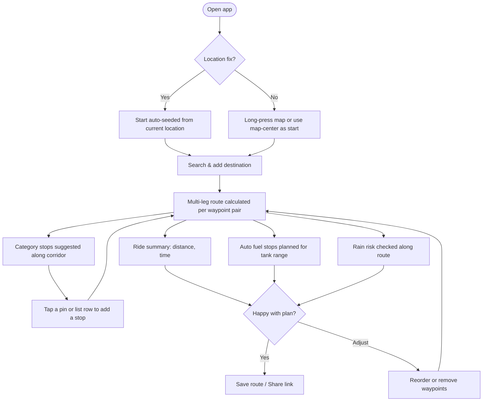
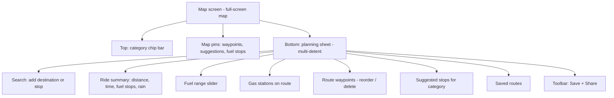

# MotoRoute - UX Design

User-experience design for **MotoRoute**: user journeys, screen architecture, interaction states, and the design system. This documents the app as built today plus UX considerations for the forward-looking vision.

> Product requirements, feature spec, roadmap, and metrics live in the companion document: [PRD.md](PRD.md).

---

## 1. Design Principles

- **The ride is the unit of work.** Planning context (map + sheet) stays on screen; the planning sheet is non-dismissible so riders never lose their place.
- **Map-first, list-second.** Everything is visible and tappable on the map; the bottom sheet is the structured companion for detail and ordering.
- **Surface risk early.** Fuel gaps and rain are shown with color-coded, plain-language warnings before departure.
- **One-tap stop adding.** Any suggested or gas pin can be added with a single tap, then the route updates automatically.

---

## 2. Core User Journeys

### 2.1 Plan a ride (primary journey)

### 2.2 Refuel-aware planning
Rider sets tank range with a slider (50-300 mi). When the ride is longer than one tank, the app greedily places refuel stops - preferring the farthest gas station within ~85% of range (a reserve buffer) and only falling back to the full range if needed. If a stretch has no reachable gas, a **fuel-gap warning** appears.

### 2.3 Discover stops
Rider switches the category chip (Gas / Food / Coffee / Scenic). The app searches the route corridor and shows pins on the map plus a ranked list (sorted by distance from start). Tapping adds the stop before the final destination and re-routes.

### 2.4 Save & share with a group
Rider taps the bookmark to save the ride locally (auto-named "Start to End"), or shares a `motoroute://` link. A recipient with the app installed opens the link and the exact ride - waypoints and suggested stops - is reconstructed on their device.

---

## 3. Screen Architecture

### 3.1 Map screen
- Full-screen `Map` with the user's location, waypoint markers (green start flag, red checkered destination, orange intermediate pins), and blue route polylines per leg.
- Suggestion pins are tappable to add a stop; recommended fuel stops are drawn last and highlighted so they stand out in any category.
- Long-press drops a start point (reverse-geocoded for a readable name).

### 3.2 Planning sheet (bottom sheet)
- Multi-detent: small (~15%), medium, large; background map stays interactive up through medium. Non-dismissible so planning context is never lost.
- Sections appear contextually (e.g. "Gas Stations on Route" only when browsing a non-gas category and a route exists).

### 3.3 Category chip bar
- Horizontally scrolling capsule chips at the top; selected chip is filled blue. Switching re-runs corridor search for that category.

---

## 4. Interaction States

- **Empty:** prompts to set a start (long-press / map-center) and search for a destination.
- **Loading:** "Calculating route..." and "Searching along your route..." progress indicators.
- **Error:** routing failures shown in red within the summary.
- **Fuel gap:** orange warning when a stretch exceeds range with no reachable gas.
- **Rain:** blue warning with percent chance and approximate location; "Checking weather..." while in flight.

---

## 5. Design System

### Color semantics (as used today)
- **Green** - ride start flag and recommended fuel stops (the "good / go" signal).
- **Red** - destination and routing errors.
- **Orange** - intermediate waypoints and fuel-gap warnings (caution).
- **Blue** - route polylines, primary actions, selected chips, and rain info.
- **Gray** - non-recommended gas stations (secondary, still pickable).

### Iconography (SF Symbols)
- Gas: `fuelpump.fill` - Food: `fork.knife` - Coffee: `cup.and.saucer.fill` - Scenic: `binoculars.fill`.
- Start: `flag.fill` - Destination: `flag.checkered` - Intermediate: `mappin`.
- Actions: `magnifyingglass`, `plus.circle(.fill)`, `bookmark(.fill)`, `square.and.arrow.up`.

### Components & patterns
- Capsule category chips.
- Map annotations on `.thinMaterial`/material backgrounds in circles; highlighted fuel stops get a white ring + shadow.
- Grouped `List` sections inside a `NavigationStack` for the planning sheet.
- Slider with min/max value labels and monospaced digit readout for the fuel range.

### Typography
- System font with semantic weights (`.subheadline.weight(.medium)` for chips, `.caption`/`.caption2` for secondary metadata). Distances/durations use `MKDistanceFormatter` and `Duration` formatting for locale correctness.

---

## 6. UX Considerations for the Roadmap

These tie to the phased roadmap in [PRD.md, section 6](PRD.md#6-forward-looking-roadmap-vision):
- **Settings screen:** a dedicated place for default tank range, units, and search density so per-ride controls can be simplified.
- **Scenic vs. fast preference:** a clear toggle/segment when scenic routing is integrated, with an indication of the trade-off (extra time/distance).
- **Sync state:** once CloudKit is added, saved routes need subtle sync/conflict affordances.
- **Onboarding:** first-run flow to capture tank range and grant location, so the first ride plans cleanly.
